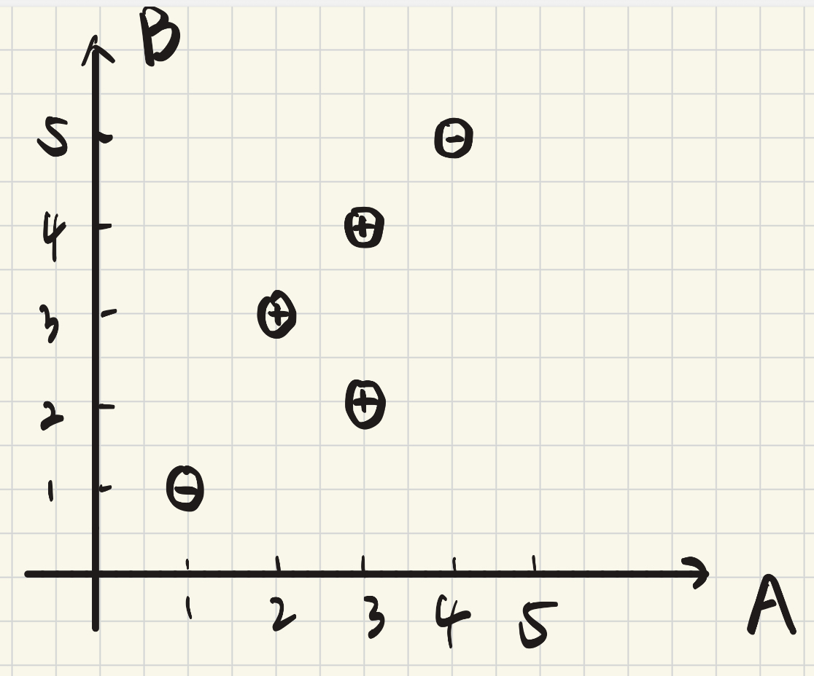
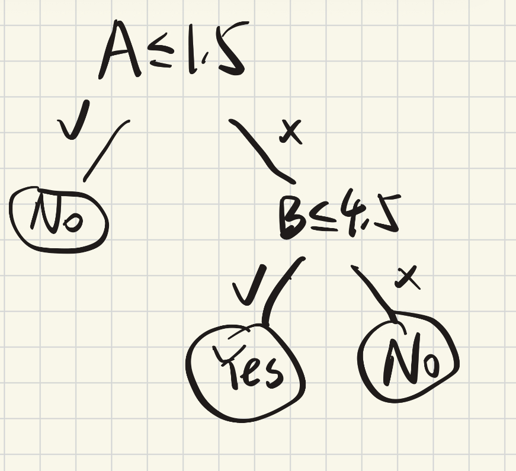

### 姓名：朱恒辉
### 学号：12412412

## 1
1. 
2. not linearly separable
3. NN and DT are more suitable since they can handle non-linear data. While SVM need to use kernal trick or soft margin to deal with it, its performance may not be good.

## 2
1. 
$x=(1,A,B),y \in \{-1,+1\}$
- Pellet Power: x=(1,1,1),y=−1
- Ghosts!: x=(1,3,2),y=+1
- Pac is Bac: x=(1,4,5),y=−1
- Not a Pizza: x=(1,3,4),y=+1
- Endless Maze: x=(1,2,3),y=+1
1. $w←w+yx$
   $w_{initial}=(0,0,0)$
   $w←(0,0,0)+(−1)(1,1,1)=(−1,−1,−1)$
2. 
   1. Yes. Since $A+B>8 \to Yes$ can be transformed to $A+B-8>0 \to w_0+w_1A+w_2B>0$ where $w=(-8,1,1)$.
   The bound is a line A+B=8, this is what perceptron can learn.
   2. No. Because the set of positive samples are (2,2),(2,3),(3,2),(3,3).It is not linearly separable from the negative samples in the (A,B) plane. A single linear boundary cannot isolate the region where both scores are 2 or 3.
   3. No. Because the set of positive samples are (1,1),(2,2),(3,3),(4,4),(5,5).It is not linearly separable from the negative samples in the (A,B) plane. 

## 3
1. Since the dataset is not linearly separable, a hard-margin SVM cannot perfectly separate all samples. Therefore, we use a soft-margin SVM, which allows some samples to be misclassified or lie inside the margin.
2. 
- role of c: control the trade-off between maximizing the margin and minimizing the classification error.
- effect of c: A smaller c allows for a wider margin but more misclassifications, while a larger c aims to classify all training examples correctly but may lead to a smaller margin.
3. Soft margin SVM optimizes margin maximization and error minimization but these objectives conflict, so C balances them.

## 4 
1. 
When constructing a decision tree, the splitting feature is usually chosen based on criteria such as information gain or Gini impurity. The goal is to make the child nodes as pure as possible. In this dataset, splitting on A≤1.5 first isolates the sample (1,1), and splitting on B≤4.5 then separates the remaining positive and negative samples effectively.
2. A shallow tree may underfit because it cannot capture enough patterns in the data, while a deep tree may overfit, especially on such a small dataset. Pruning can prevent overfitting by removing unnecessary branches. This reduces model complexity and usually improves generalization on unseen data.

## 5

1. Model Comparison

- **SVM**
  - Pros: Strong theory, can handle non-linear data with kernel
  - Cons: Needs parameter tuning (C, kernel), less interpretable

- **Neural Network**
  - Pros: Very powerful, can model complex non-linear patterns
  - Cons: Needs more data, harder to train and interpret

- **Decision Tree**
  - Pros: Easy to interpret, handles non-linear data well, suitable for small datasets
  - Cons: Prone to overfitting

2.  Model Selection

The dataset is small and not linearly separable.

- SVM can be applied with soft margin or kernel, but requires tuning
- NN is capable but unnecessary for such a small dataset
- DT can naturally handle non-linear patterns and works well on small data

Decision Tree is the most suitable model for this task due to its simplicity, interpretability, and ability to handle non-linear data with small sample size.